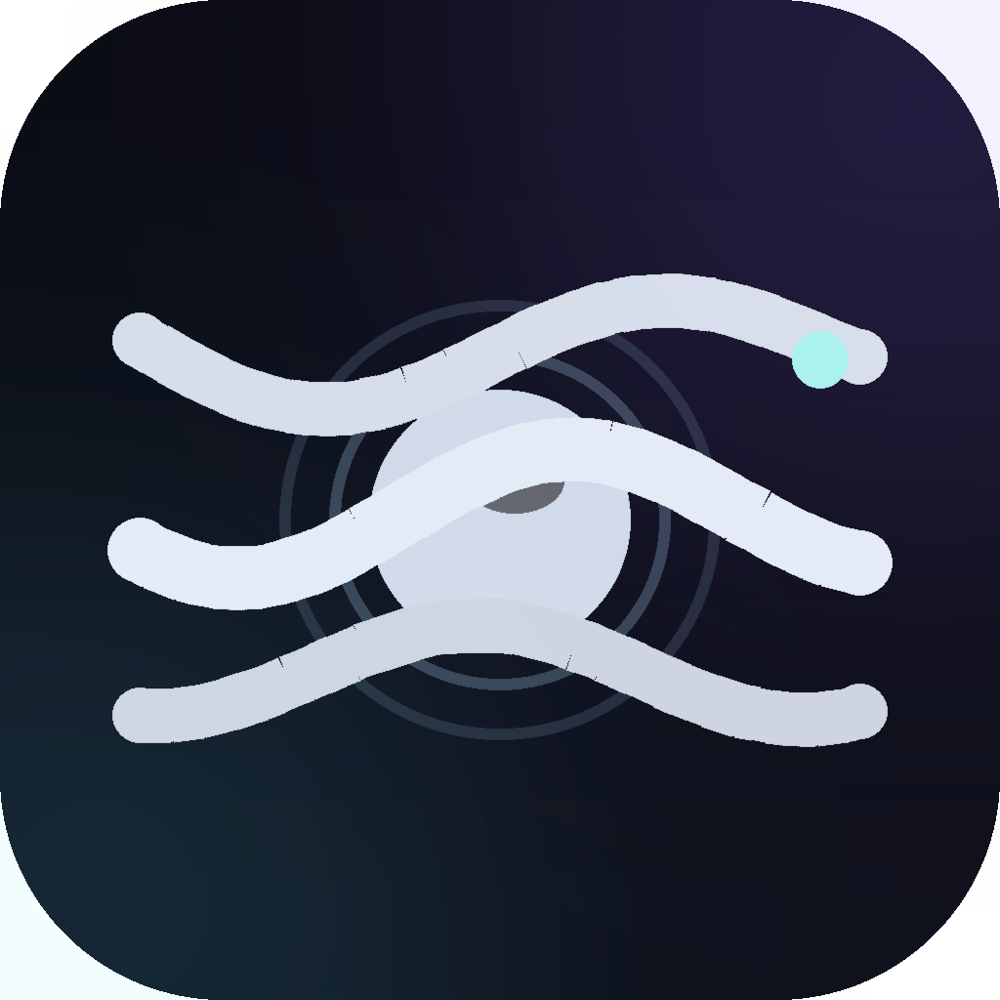
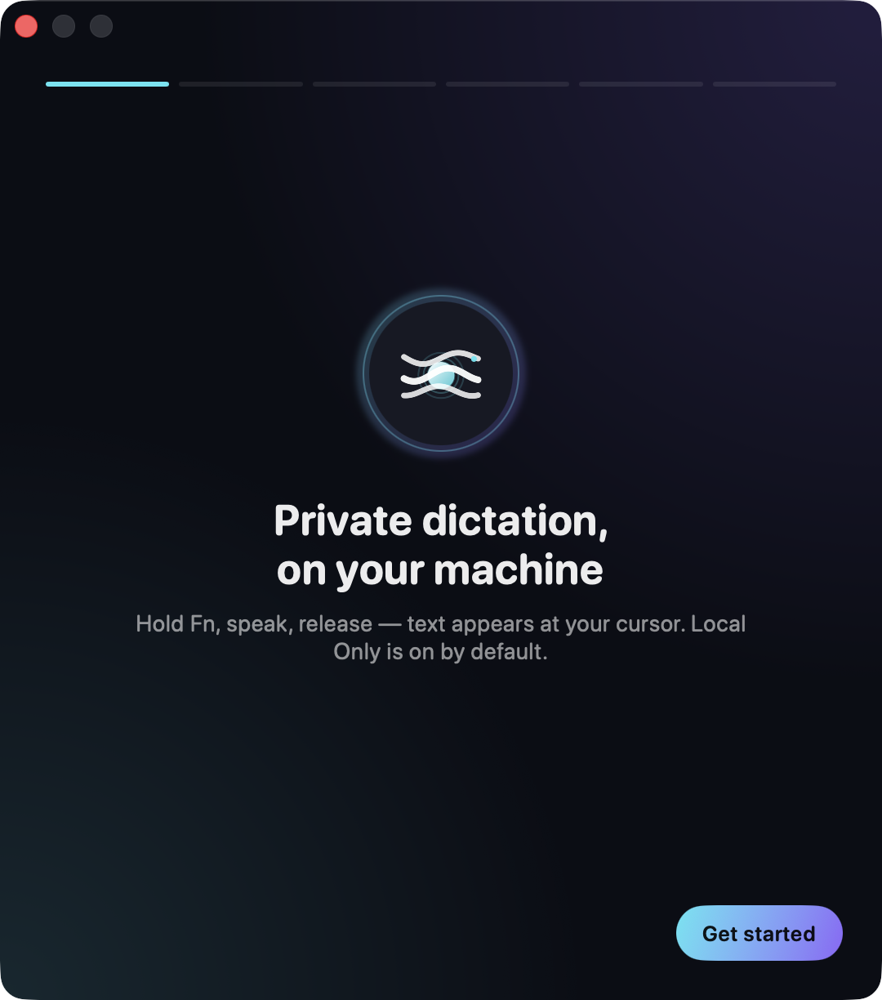
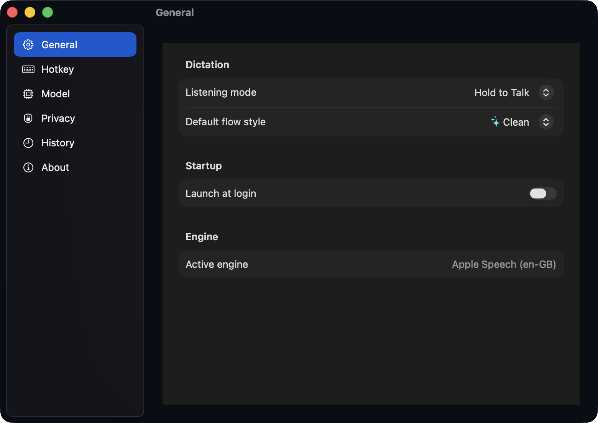
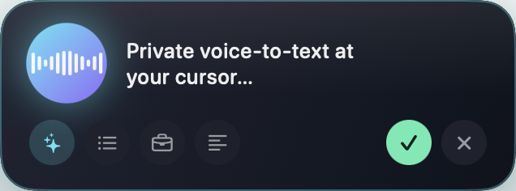
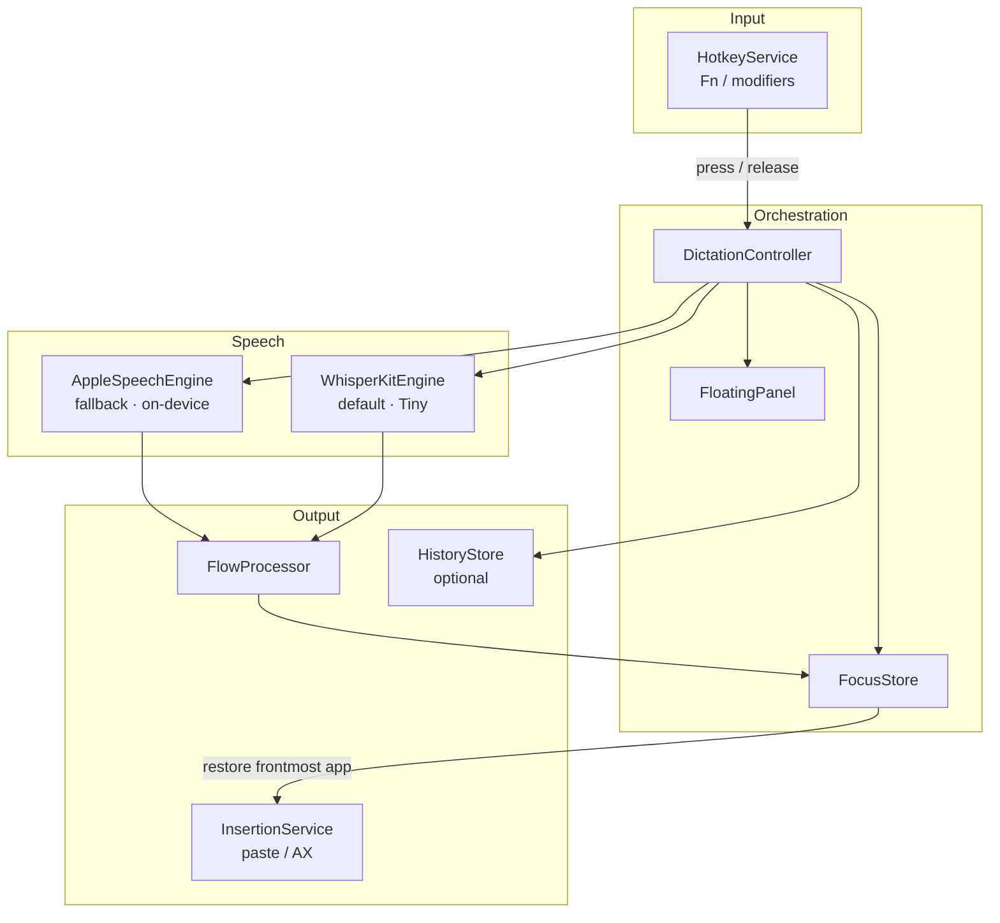

# ZephyrFlow

<div align="center">

[](LICENSE)
[](https://www.apple.com/macos/)
[](https://swift.org/)
[](https://joe-broadhead.github.io/zephyr-flow/)
[](https://github.com/joe-broadhead/zephyr-flow/actions/workflows/ci.yml)
[](https://github.com/joe-broadhead/zephyr-flow/releases)

</div>

```
 _____          _                _____ _
|__  /___ _ __ | |__  _   _ _ __|  ___| | _____      __
  / // _ \ '_ \| '_ \| | | | '__| |_  | |/ _ \ \ /\ / /
 / /|  __/ |_) | | | | |_| | |  |  _| | | (_) \ V  V /
/____\___| .__/|_| |_|\__, |_|  |_|   |_|\___/ \_/\_/
         |_|          |___/

  Private voice-to-text direct to your cursor
```

<div align="center">

Hold **Fn** · speak · release — polished text lands where you were typing.  
**Local Only by default** (your audio stays on-device). No analytics. No telemetry.  
Default engine: **Whisper Tiny** (one-time ~75 MB model download, then fully local).

[Docs](https://joe-broadhead.github.io/zephyr-flow/) · [Quickstart](docs/getting-started/quickstart.md) · [Privacy](docs/guide/privacy.md) · [Releases](https://github.com/joe-broadhead/zephyr-flow/releases)

<br/>



</div>

---

## Screenshots

<p align="center">
  
  &nbsp;
  
</p>

<p align="center">
  
</p>

---

## What it does

ZephyrFlow is a macOS menu-bar dictation app:

1. Hold **Fn** (configurable)
2. A glass panel appears near the cursor with live waveform + interim text
3. Release → text is cleaned and inserted at the caret

> Public preview (`v0.x`): **v0.0.0** is on [GitHub Releases](https://github.com/joe-broadhead/zephyr-flow/releases). Builds are **ad-hoc signed** (not Developer ID / notarized) until Apple Developer validation is configured.

## Highlights

- **Hold-to-talk Fn** — Wispr-style global hotkey on a dedicated event-tap thread  
- **Whisper Tiny by default** — downloads once, then runs fully on-device (Neural Engine), with **live interim text** while you hold  
- **Local Only** — your voice/transcripts stay on this Mac; Apple Speech remains a built-in fallback  
- **Focus restore + smart insert** — per-app paste/AX strategies; secure fields stay copy-only  
- **Flow styles** — clean, bullets, professional, summary, raw (optional Enhanced on-device rules)  
- **Check for Updates** — on-demand GitHub Releases (no background pings)  
- **Auditable** — greppable privacy posture + core tests  

## 30-second install (from source)

```bash
git clone https://github.com/joe-broadhead/zephyr-flow.git
cd zephyr-flow
./Scripts/build_app.sh release
xattr -cr Dist/ZephyrFlow.app
open Dist/ZephyrFlow.app
```

If macOS blocks the app: right-click → **Open** (ad-hoc preview signing).

Then grant **Microphone** and **Accessibility**, allow the first-run Whisper Tiny download if prompted, click into Notes, hold **Fn**, speak, release.  
(Apple Speech fallback also needs **Speech Recognition** + **Keyboard → Dictation → On**.)

**Platform:** Apple Silicon (arm64) recommended; release artifacts are arm64.

## Architecture



| Module | Role |
|--------|------|
| `ZephyrFlowCore` | Models, protocols, `FlowProcessor` (no AppKit) |
| `ZephyrFlow` | App, services, SwiftUI, optional WhisperKit link |

Session path: **Fn hold → panel + STT → release → flow → focus restore → paste/AX insert**.

## Privacy — how to audit

| Claim | Check |
|-------|--------|
| No analytics | `rg -i 'telemetry\|analytics\|sentry\|firebase' Sources` |
| Local Only default | `AppSettings.default.localOnlyMode == true` |
| Default model Whisper Tiny | `AppSettings.default.preferredModel == .whisperTiny` |
| Model downloads allowed (files only) | `allowModelDownloads == true` |
| No transcript log bodies | logs are lengths/events only |
| Tests | `swift run ZephyrFlowCoreTests` |

Details: [Privacy guide](docs/guide/privacy.md).

## Development

```bash
swift run ZephyrFlowCoreTests
./Scripts/build_app.sh debug
./Scripts/generate_app_icon.py    # Resources/AppIcon.icns + docs/images
./Scripts/capture_screenshots.sh  # docs/images product shots
# docs
python3 -m venv .venv && .venv/bin/pip install -r docs/requirements.txt
.venv/bin/mkdocs serve
```

See [Contributing](CONTRIBUTING.md), [AGENTS.md](AGENTS.md), and [Release](docs/development/release.md).

## License

[MIT](LICENSE)
