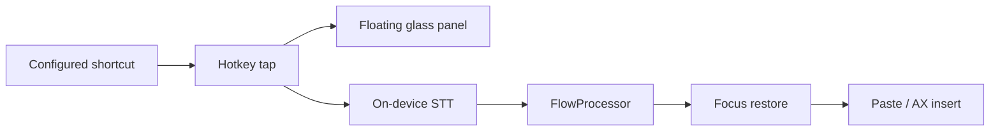

# ZephyrFlow

**Private voice-to-text that appears at your cursor.**

ZephyrFlow is a macOS menu-bar dictation app. Hold **Control-Option-Space** (or
your saved shortcut), speak, then release for validated insertion or review.
**Local Only is on by default**. Fn / Globe is experimental, not the new-install default.

!!! warning "Qualification target, not production acceptance"
    The human-selected initial target is macOS 15.x / Apple Silicon / US English / Whisper Tiny or on-device Apple Speech / Notes, TextEdit, Terminal, Safari, VS Code and Slack. Device qualification and independent review remain pending; other combinations are experimental. See the [qualification boundary](development/contracts/supported-platform-matrix.md).

!!! tip "Privacy first"
    Default engine is **Whisper Tiny** (one-time ~75 MB model download, then fully on-device). No analytics. No telemetry. No crash reporter. Local Only governs **your voice** — not the optional model-file fetch.

## Look & feel

{ width="280" }
{ width="360" }
{ width="320" }

## Developer build (not production installation)

```bash
git clone https://github.com/joe-broadhead/zephyr-flow.git
cd zephyr-flow
./Scripts/build_app.sh debug
open Dist/ZephyrFlow.app
```

1. Use explicit Setup actions for required capabilities; Whisper does not need Speech permission
2. Click into Notes
3. **Hold Control-Option-Space** (or your saved shortcut) → speak → **release**

## Architecture



## Where to go next

| Goal | Page |
|------|------|
| Install a release build | [Installation](getting-started/installation.md) |
| First successful dictation | [Quickstart](getting-started/quickstart.md) |
| Why permissions matter | [Permissions](getting-started/permissions.md) |
| Audit the privacy claims | [Privacy](guide/privacy.md) |
| Contribute | [Contributing](development/contributing.md) |

## Status

The forward candidate is proposed/unreleased and not approved for production.
Developer builds are ad-hoc, not accepted distribution. Production requires
Developer ID + notarization, exact-candidate device evidence, independent review
and explicit human GO. Release preflights are currently blocked; credentials
alone do not finish implementation or approval.
