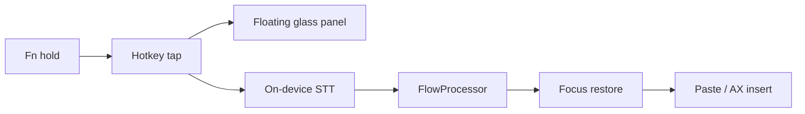

# ZephyrFlow

**Private voice-to-text that appears at your cursor.**

ZephyrFlow is a macOS menu-bar dictation app. Hold **Fn**, speak, release — polished text lands exactly where you were typing. **Local Only is on by default** so your audio and transcripts stay on this Mac.

!!! tip "Privacy first"
    Default engine is **Whisper Tiny** (one-time ~75 MB model download, then fully on-device). No analytics. No telemetry. No crash reporter. Local Only governs **your voice** — not the optional model-file fetch.

## Look & feel

{ width="280" }
{ width="360" }
{ width="320" }

## 30-second path

```bash
git clone https://github.com/joe-broadhead/zephyr-flow.git
cd zephyr-flow
./Scripts/build_app.sh release
open Dist/ZephyrFlow.app
```

1. Enable **Microphone**, **Accessibility**, and **Speech Recognition**
2. Click into Notes
3. **Hold Fn** → speak → **release**

## Architecture



## Where to go next

| Goal | Page |
|------|------|
| Install a release build | [Installation](getting-started/installation.md) |
| First successful dictation | [Quickstart](getting-started/quickstart.md) |
| Why permissions matter | [Permissions](getting-started/permissions.md) |
| Audit the privacy claims | [Privacy](guide/privacy.md) |
| Contribute | [Contributing](development/contributing.md) |

## Status

`v0.x` is a public preview. Builds are **ad-hoc signed** (not Developer ID / notarized) until Apple Developer validation is in place. Expect rapid iteration before `v1.0.0`.
